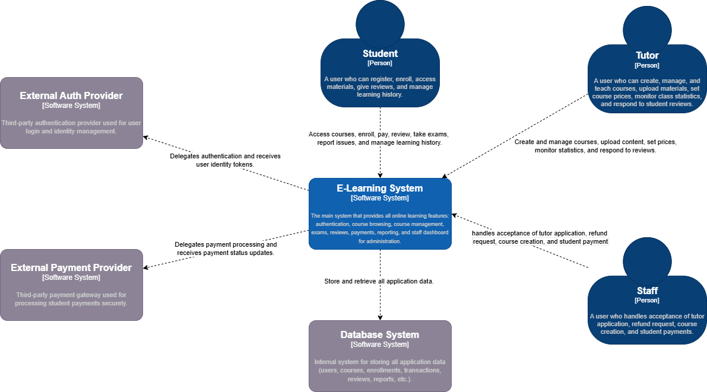
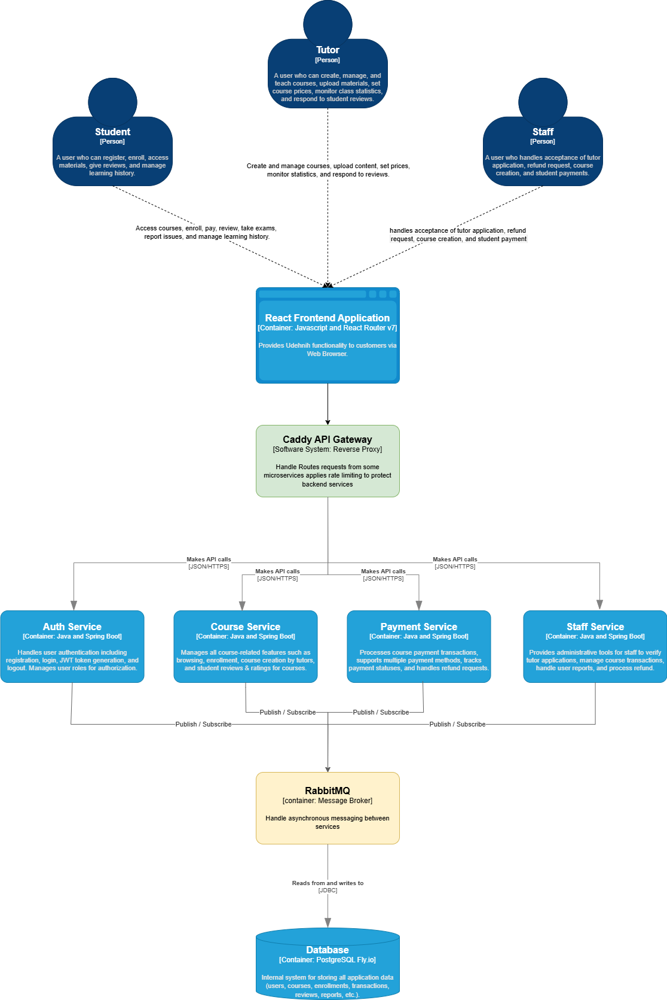

# Group Diagram

## Context Diagram (Before)

## Context Diagram (After)

Arsitektur awal menempatkan seluruh proses autentikasi dan pembayaran di dalam E-Learning System. Hal ini meningkatkan risiko terjadinya pelanggaran keamanan, kebocoran data, dan masalah kepatuhan regulasi. Jika ada celah keamanan pada sistem, data sensitif pengguna maupun informasi pembayaran bisa saja dicuri atau disalahgunakan. Selain itu, sistem juga harus memenuhi standar keamanan yang rumit (seperti PCI DSS untuk pembayaran), yang tentu saja sulit dan mahal untuk diimplementasikan sendiri.

Dengan mengintegrasikan layanan autentikasi dan pembayaran eksternal, E-Learning System dapat menyerahkan proses-proses sensitif ini ke pihak ketiga yang sudah terpercaya dan memiliki sertifikasi keamanan serta kepatuhan. Risiko pencurian kredensial, penipuan pembayaran, dan pelanggaran regulasi pun dapat ditekan. Tim pengembang juga bisa lebih fokus pada fitur inti pembelajaran, sementara keamanan dan keandalan autentikasi serta pembayaran ditangani oleh provider khusus. Perubahan arsitektur ini secara signifikan meningkatkan keamanan dan mengurangi dampak jika terjadi kegagalan atau serangan pada sistem utama.

## Container Diagram (Before)

## Container Diagram (After)

Pemrosesan transaksi secara sinkron dalam sistem terdistribusi, seperti pada platform e-learning A09 Udehnih, berisiko menimbulkan kegagalan apabila terjadi gangguan jaringan atau keterlambatan respons dari layanan terkait. Kondisi ini bisa berdampak pada terganggunya pengalaman pengguna serta menimbulkan ketidakkonsistenan data, terutama pada proses-proses penting seperti pembayaran, pengelolaan kursus, maupun verifikasi staf. Setelah kami berdiskusi terkait risk analyzing, untuk mengurangi risiko tersebut, akhirnya kami sedikit melakukan modifikasi dan berniat menerapkan message queue seperti RabbitMQ. Dengan pendekatan ini, berbagai transaksi diproses secara asinkron sehingga lebih tahan terhadap kegagalan. Jika terjadi gangguan, sistem dapat mencoba kembali (retry) tanpa kehilangan data yang penting. Selain itu, penggunaan antrian pesan memungkinkan setiap modul, seperti layanan pembayaran, course service, dan staff dashboard, untuk dikembangkan dan diskalakan secara terpisah sesuai kebutuhan. Pemrosesan asinkron juga membantu menghindari masalah timeout pada transaksi yang memerlukan waktu lebih lama, sehingga keseluruhan sistem menjadi lebih stabil dan responsif.

## Deployment Diagram
