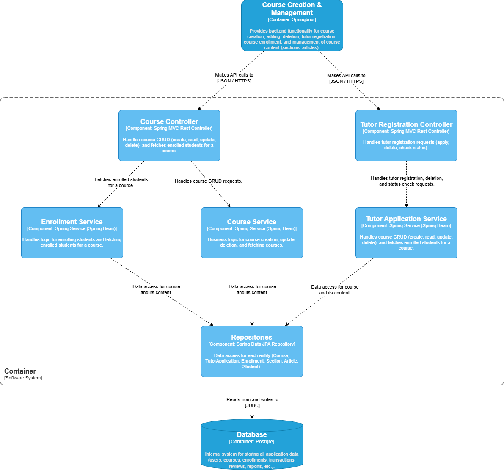
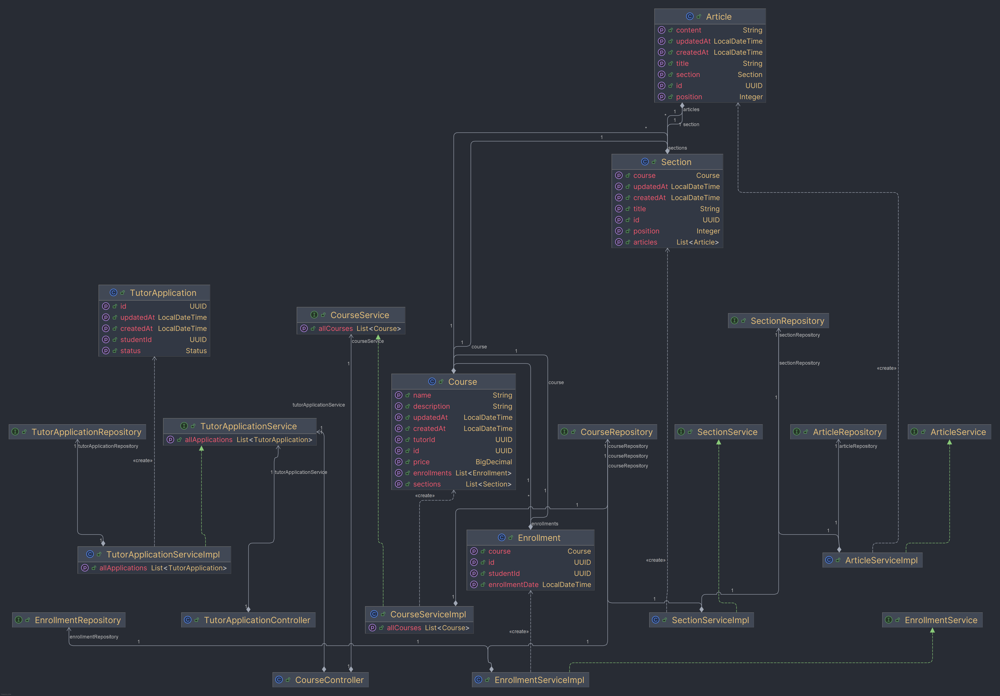

# Course Creation Diagram

### Desain Arsitektur

Desain arsitektur menggunakan pendekatan layered dan separation of concerns. Setiap komponen memiliki tanggung jawab yang jelas dan terpisah, sehingga memudahkan pengembangan, pengujian, dan pemeliharaan. Controller hanya menangani permintaan HTTP dan response, service berisi logika bisnis, sedangkan repository bertugas untuk akses data ke database. Dengan pemisahan ini, perubahan pada satu bagian (misal logika bisnis) tidak akan memengaruhi bagian lain (misal akses data), sehingga sistem menjadi lebih robust dan scalable.

Selain itu, penggunaan Spring Boot dan Spring Data JPA mempercepat pengembangan dengan menyediakan banyak fitur out-of-the-box seperti dependency injection, validasi, dan ORM. Setiap entitas (Course, TutorApplication, Enrollment, Section, Article, Student) memiliki repository sendiri, sehingga query data lebih terstruktur dan mudah di-maintain. Dengan adanya service khusus untuk Enrollment dan Tutor Application, proses bisnis seperti pendaftaran tutor dan enrollment student dapat diatur dengan aturan yang spesifik tanpa mencampuradukkan dengan logika lain.

### Rincian Cara Kerja Desain Arsitektur

1. **Controller Layer**
   - *Course Controller* menerima permintaan HTTP terkait kursus (buat, lihat, update, hapus, lihat daftar student). Permintaan ini diteruskan ke Course Service atau Enrollment Service sesuai kebutuhan.
   - *Tutor Registration Controller* menerima permintaan pendaftaran, pengecekan status, dan penghapusan aplikasi tutor, lalu meneruskan ke Tutor Application Service.

2. **Service Layer**
   - *Course Service* menangani logika bisnis pembuatan, pengubahan, penghapusan, dan pengambilan data kursus. Service ini berinteraksi dengan repository terkait (Course, Section, Article).
   - *Enrollment Service* menangani logika pendaftaran student ke kursus dan pengambilan daftar student yang terdaftar pada kursus tertentu.
   - *Tutor Application Service* menangani logika pendaftaran, pengecekan status, dan penghapusan aplikasi tutor.

3. **Repository Layer**
   - Setiap entitas memiliki repository sendiri yang mengatur query ke database. Misal, CourseRepository untuk data kursus, EnrollmentRepository untuk data enrollment, dst. Semua repository menggunakan Spring Data JPA sehingga query bisa dibuat secara deklaratif.

4. **Database**
   - Semua data aplikasi (user, course, enrollment, tutor application, section, article) disimpan di database relasional (PostgreSQL). Repository melakukan operasi baca/tulis ke database menggunakan JDBC yang di-manage oleh Spring Data JPA.

5. **Alur Kerja**
   - Ketika user (tutor/student) melakukan aksi (misal membuat kursus, mendaftar kursus, mendaftar sebagai tutor), permintaan masuk ke controller, diteruskan ke service, lalu service akan menggunakan repository untuk akses data. Hasilnya dikembalikan ke controller dan direspons ke user.
