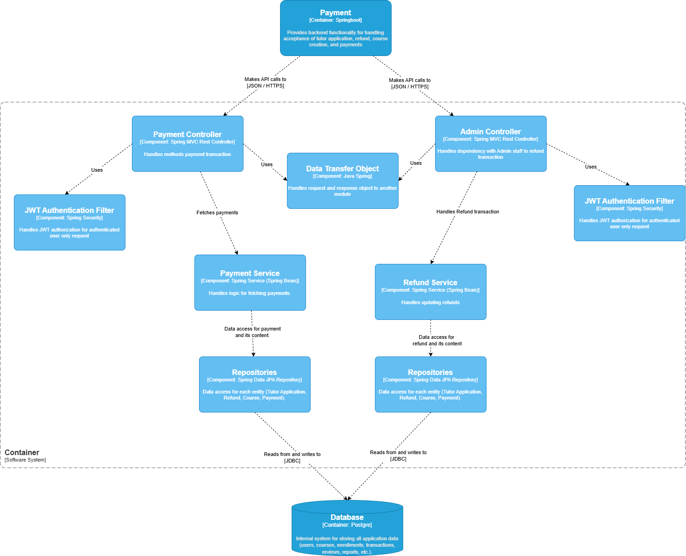

# Payment Diagram
### Code diagram

### Component diagram

### Penjelasan component Diagram Payment
**1. Payment Container (SpringBoot)**

Fungsi: Menyediakan fungsionalitas backend untuk penanganan penerimaan Payment, aplikasi, kursus, transaksi, dan Payment.
Peran: Kontainer utama yang menaungi seluruh sistem Payment.

**2. Controller Layer**
Terdapat dua controller utama:
Payment Controller (Spring MVC Rest Controller)

Fungsi: Menangani metode transaksi Payment
Interaksi: Berkomunikasi dengan Payment service dan menggunakan JWT Authentication Filter
API: Menerima permintaan API (JSON/HTTPS) dari frontend

Admin Controller (Spring MVC Rest Controller)

Fungsi: Menangani interaksi dengan staf admin untuk refund transaksi
Interaksi: Berkomunikasi dengan Refund Service dan menggunakan JWT Authentication Filter
API: Menerima permintaan API (JSON/HTTPS) dari frontend

**3. Middleware**
JWT Authentication Filter (Spring Security)

Fungsi: Menangani otentikasi JWT untuk permintaan pengguna terautentikasi
Peran: Lapisan keamanan yang memastikan hanya pengguna terautentikasi yang dapat mengakses layanan

Data Transfer Object

Fungsi: Menangani objek permintaan dan respons antar modul
Peran: Memfasilitasi komunikasi data antar komponen sistem

**4. Service Layer**
Payment Service (Spring Service/Spring Bean)

Fungsi: Menangani logika untuk melacak Payment
Interaksi: Mengakses data Payment dan kontennya melalui repositories

Refund Service (Spring Service/Spring Bean)

Fungsi: Menangani pembaruan refund
Interaksi: Mengakses data refund dan kontennya melalui repositories

**5. Data Access Layer**
Repositories (Spring Data JPA Repository)

Fungsi: Menyediakan akses data untuk setiap entitas (User Application, Refund, Course, Payment)
Interaksi: Membaca dari dan menulis ke database

**6. Database (Postgre**SQL)

Fungsi: Sistem internal untuk menyimpan semua data aplikasi (users, courses, enrollments, transactions, reviews, reports, dll.)
Peran: Penyimpanan data permanen

### Alur Kerja Sistem Payment:

Permintaan Payment:

Pengguna mengirimkan permintaan Payment melalui UI
Permintaan diterima oleh Payment Controller setelah melewati JWT Authentication Filter

Pemrosesan Payment:

Payment Controller meneruskan ke Payment Service
Payment Service menjalankan logika bisnis dan menyimpan data transaksi melalui Repositories

Penanganan Refund:

Admin berinteraksi melalui Admin Controller
Permintaan refund diproses oleh Refund Service
Data refund diperbarui di database melalui Repositories

Penyimpanan Data:

Semua data transaksi Payment dan refund disimpan dalam database PostgreSQL
Repositories bertanggung jawab untuk operasi CRUD terhadap database